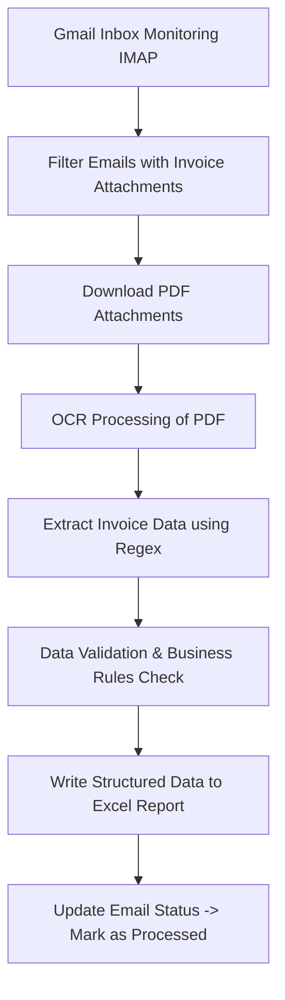

# Intelligent Invoice Processing Bot using UiPath

## Overview
The Intelligent Invoice Processing Bot is an RPA solution developed using UiPath to automate the end-to-end invoice handling process. The bot monitors a Gmail inbox, extracts invoice data from PDF attachments, validates the extracted information, and generates structured Excel reports for further processing.

This automation significantly reduces manual effort and improves processing accuracy.

---

## Problem Statement
Manual invoice processing is time-consuming, error-prone, and inefficient, especially when dealing with high email volumes and PDF attachments.

The objective of this project was to automate:
- Email monitoring
- Invoice data extraction
- Data validation
- Structured reporting

---

## Solution Approach

The bot performs the following steps:

1. Connects to Gmail inbox using IMAP protocol.
2. Identifies emails containing invoice attachments.
3. Downloads PDF attachments.
4. Extracts invoice details using OCR and Regular Expressions.
5. Validates extracted data.
6. Updates structured Excel reports.
7. Marks processed emails to prevent duplicate processing.

---

## Key Features

- Automated Gmail monitoring using IMAP
- PDF invoice data extraction using OCR
- Regex-based data parsing
- Data validation logic implementation
- Structured Excel reporting
- Email status management to avoid duplication
- Exception handling and logging

---

## Tools & Technologies Used

- UiPath Studio
- UiPath Robot
- IMAP Protocol
- OCR Engine
- Regular Expressions
- Excel Automation
- Exception Handling Framework

---

## Workflow Architecture

Email Inbox → Attachment Download → OCR Extraction → Data Validation → Excel Reporting → Email Status Update

---

## Business Impact

- Reduced manual invoice processing effort by approximately 70%
- Improved data accuracy and consistency
- Eliminated duplicate invoice handling
- Increased operational efficiency

---

## Future Enhancements

- Integration with ERP systems (SAP / Tally / Oracle)
- Deployment via UiPath Orchestrator for scheduled execution
- Dashboard for invoice analytics and tracking
- AI-based intelligent document classification

---

## Workflow Diagram

---

## Author
Shreya Asthana  
B.Tech Computer Science & Engineering  
RPA Developer | UiPath Enthusiast
